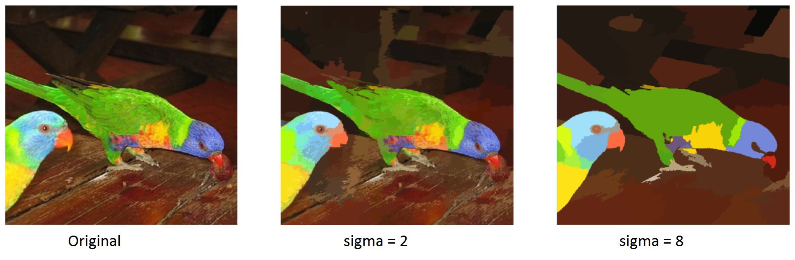
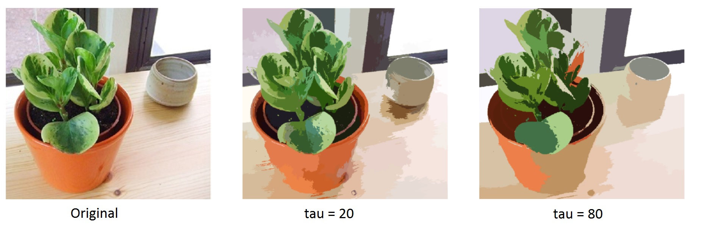
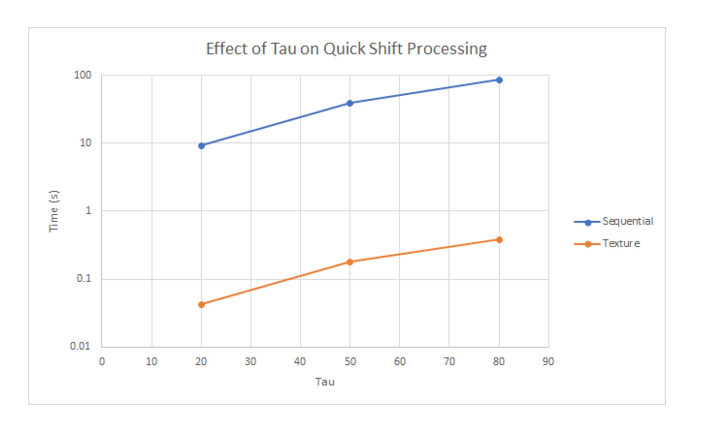

# Final Writeup

## Summary
We parallelized QuickShift, an image segmentation algorithm, using CUDA on an Nvidia 1080 GTX.

## Background
Image segmentation is the process of dividing an image into multiple segments, in order to change the image into something easier to analyze. Segmentation algorithms have played a big role in computer vision research, and can be implemented using many different algorithms, some of which include thresholding, clustering, using minimum spanning trees, and quick shift. In this project, we will explore the implementations of quick shift for image segmentation and its optimizations using parallelization in CUDA and openMP.

The main idea of quick shift is to move each point to the nearest neighbor that would lead to an increment of the density, where the density estimate is found using a Parzen window density estimate around each point. All the pixels and its connections with its neighbors form a tree, where the root of the tree is the point with the highest density estimate. Each connection between points has an associated distance, and the segmentation of the tree is calculated by removing all links in the tree that have a distance that’s greater than a chosen threshold. Each segment is formed by the pixels that are a part of each resulting disconnected tree.

# Implementation
Because of its massively parallel architecture, graphics processing units (GPUs) are especially useful for accelerating compute-intensive functions in computer graphics, such as image segmentation. By launching kernels to run the parallel computations on pixels, GPUs can help the algorithm attain great speedup.

The main data structures in our application are the input image array, output image array, density array, and parents array. The dependencies in the quickshift algorithm include ensuring that all the densities of the pixels are calculated before the parents are calculated. Also, it’s important that the parent of each pixel is calculated correctly so that each pixel are linked to its closest neighbor to form the segments of the image. 

# Approach
Sequential: First, we implemented the quickshift algorithm in C++ with openCV and a library of quickshift functions called VLFeat [2]. By using the code as a starting point, we implemented a sequential CPU version that took an image as an input, converted the image to an image array, ran the quickshift algorithm on the array and obtained the parents and distances in the tree, and created the output image array. The parameters that can be adjusted are σ, which represents kernel size for the Parzen window estimator for density calculations, and τ, which represents the maximum distance between two pixels considered when the algorithm builds the forest of segmented trees. After getting the parents array, we then calculated the segments of the image by finding the root of the segmenting tree for each pixel by iterating up the segmenting tree until the root is reached. Then, that pixel’s color is the painted the root’s color to segment the image. Since the VLFeat library utilized column-major order for the array accesses, we also decided to modify the arrays to be row-major to better utilize cache locality since C++ stores arrays contiguously in memory in row-major order.

Initial CUDA: After finishing our sequential implementation, we used CUDA to move the compute-intensive operations from the CPU to GPU for parallelization. With CUDA, the density estimates using the Parzen window estimate equation was calculated in parallel across the pixels, and the nearest neighbor was set to be the parent of each pixel also in parallel. To do this, we launched get_density() nad get_parents() kernels with thread blocks of size (32, 32).

Optimizing CUDA: After starting with parallelizing on CUDA, we considered many different approaches and optimizations for our quickshift algorithm parallelization. We looked for opportunities in the algorithm to parallelize, but since we already placed the main two functions of calculating densities and parents into a kernel, there was not much room elsewhere to parallelize computation. Therefore, we looked to optimize in through data storage and accesses. To achieve lower memory access costs, we looked to utilize NVIDIA’s different kinds of memory options to reduce latency on global memory accesses.

We first considered using shared memory, since each pixel accesses pixels around it when calculating its density and parents, so each block would use the same data. We placed both the pixels in the block, as well as the neighbors around the block, up to either σ or τ. However, as the values of σ and τ increase, the size of the shared memory would be increased by a quadratic factor, since each block accesses O(τ^2) or O(σ^2) pixels around it. Therefore, the size of shared memory needed was not sufficiently large enough to be utilized.

We then researched the different types of memory available, and decided to implement the algorithm using texture memory. We mapped the image array into a 3D texture, and the density array into a 2D texture. Texture memory is especially good for algorithms with high 2D spacial locality, which our algorithm has since each pixel accesses a block of pixels around it.

## Results
To evaluate the results of our project, we implemented a checker that verified that each of the implementations are outputting the same results. To do this, we verify that the resulting parents for each pixel in the segmenting tree is the same for each implementation for any given picture and are therefore generating the same segmenting trees from the density and parent calculations.

To test our speedup, we ran our implementations with the PASCAL-2007 image dataset. We ran our baseline sequential implementation and compared it with our constant memory implementation and texture memory implementations. As seen in our graphs below, we ran tests using different σ, τ, and image dimensions. As mentioned previously, the parameter σ represents kernel size for the Parzen window estimator for density calculations and τ represents the maximum distance between two pixels considered when the algorithm builds the forest of segmented trees. We utilized a cycle timer to time our quickshift process function, which includes the density calculation and parents calculations.

Image Examples:
Increasing σ results in a smoother density estimate. The following is the image on the left (original) segmented with σ = 2 and σ = 8. τ was held constant at 50, and the image size was constant at 512.



Increasing τ increases the size of the region. The following is the image on the left (original) segmented with τ = 20 and τ = 80. σ was held constant at 2, and the image size was constant at 512.


The following graphs show speedup with respect to image size, σ, and τ. When timing the density and parent calculations, we obtained about 200x speedup compared to the CPU implementation. 

Graphs:




---

## Summary
We are going to implement image segmentation on a GPU using parallelized quick shift, a fast mode seeking algorithm.

## Background
Image segmentation is the process of dividing an image into multiple segments, in order to change the image into something easier to analyze. Segmentation algorithms have played a big role in computer vision research, and can be implemented using many different algorithms, some of which include thresholding, clustering, using minimum spanning trees, and quick shift. In this project, we will explore the implementations of quick shift for image segmentation and its optimizations using parallelization in CUDA and openMP. Quick shift is a kernelized version of a mode seeking algorithm which is similar conceptually to mean shift or medoid shift. 

The main idea of quick shift is to move each point to the nearest neighbor that would lead to an increment of the density, and the calculations of the density follow from similar equations for mean shift or medoid shift. All the pixels and its connections with its neighbors form a tree, where the root of the tree is the point with the highest density estimate. Each connection between points has an associated distance, and the segmentation of the tree is calculated by removing all links in the tree that have a distance that’s greater than a chosen threshold. Each segment is formed by the pixels that are a part of each resulting disconnected tree.

The following is pseudocode for quick shift image segmentation:
```
function computeDensity()
for x in all pixels
  P[x] = 0
  for n in all pixels less than 3*sigma away
    P[x] += exp(-(f[x]-f[n])^2 / (2*sigma*sigma))
    
function linkNeighbors()
for x in all pixels
  for n in all pixels less than tau away
    if P[n] > P[x] and distance(x,n) is smallest among all n
      d[x] = distance(x,n)
      parent[x] = n
```

Quick shift image segmentation is prime for parallelization because density computations and neighbor calculations occur on each pixel of the image, and the computations don’t affect the pixels are distant from one another. This way, we can parallelize across pixels.

## Challenge
Implementing the sequential algorithm described in the paper in parallel will be challening. Additionally, the bottleneck on this algorithm is memory latency, since global memory on the GPU is slow. In the paper, they address this by using a texture cached approach of loading pixels. This will be tricky to implement.

## Resources
We plan to start from the methods described in this paper:
["Brian Fulkerson and Stefano Soatto, et. al Really quick shift: Image segmentation on a GPU"](http://www.vision.cs.ucla.edu/papers/fulkersonS10really.pdf).
We will also be using NVIDIA GeForce GTX 1080 on the GHC machines.

## Goals and Deliverables
#### Plan to achieve
Implement the quick shift algorithm as described in the paper and obtain similar speedup (10-50x speedup on practical images) over the CPU implementation.

#### Hope to achieve
Try to achieve higher speedup by approximating density via subsampling.

#### Demo
In our demo, we plan to show the difference between the CPU implementation and our implementation in regards to time, but the similarity in quality of segmentation.

## Platform Choice
Similar to assignment 2, we will be writing in C++ and using CUDA to implement the parallelized quick shift algorithm on the GPU. We will be running the code on the NVIDIA GeForce GTX 1080 on the GHC machines. These computers would be useful for this implementation because its architecture allows us to test on multi-core machines that employs CUDA processing.

## Schedule
April 12 - Finish researching and understanding the algorithm

April 15 - Have sequential implementation of quick shift algorithm

April 25 - Have major CUDA kernels written        

April 29 - Finish CUDA implementation    

May 6 - Improvements and testing   

May 12 - Final Presentation    

---

# Checkpoint

## Updated Project Timeline
Saturday April 29th - finish testing sequential implementation

Tuesday May 2nd - finish implementing parallel implementation

Saturday May 6th - start implementing density approximation

Tuesday May 9th - finish implementing density approximation

Friday May 12th - finish testing and writeup, project due

## Work Completed So Far
Currently we have finished understanding and implementing the quick shift algorithm. We worked with learning how to convert images to pixel arrays, and switched from using MatLab, Octave, to openCV. We have also found a library of a sequential quickshift implementation, and we’re currently adding timing code to that we can use it to compare with our parallel implementation.

## Goals and Deliverables
With respect to our goals and deliverables, our timeline has slightly shifted as we did more research into the libraries and tools available to us. Originally, we were planning on developing a sequential implementation of the quick shift algorithm, but since we found an existing library of a sequential implementation, we’re going to build upon this implementation for testing and focus on parallelizing it for the GPU. We still plan on having a parallel implementation working for the competition, and we aim to use subsampling to further parallelize our algorithm.

## Parallelism Competition
At the parallelism competition, we plan to show a graph comparing the speedups of the sequential, parallel, and parallel with sub-sampling implementations. In addition, we plan on showing the before and after images of the image segmentation process.
